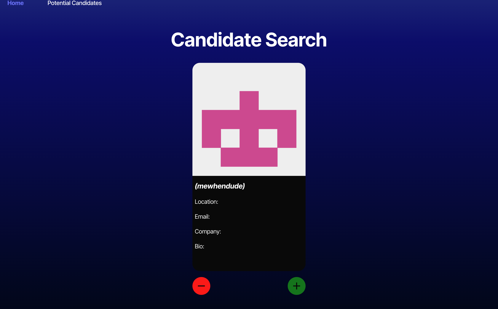
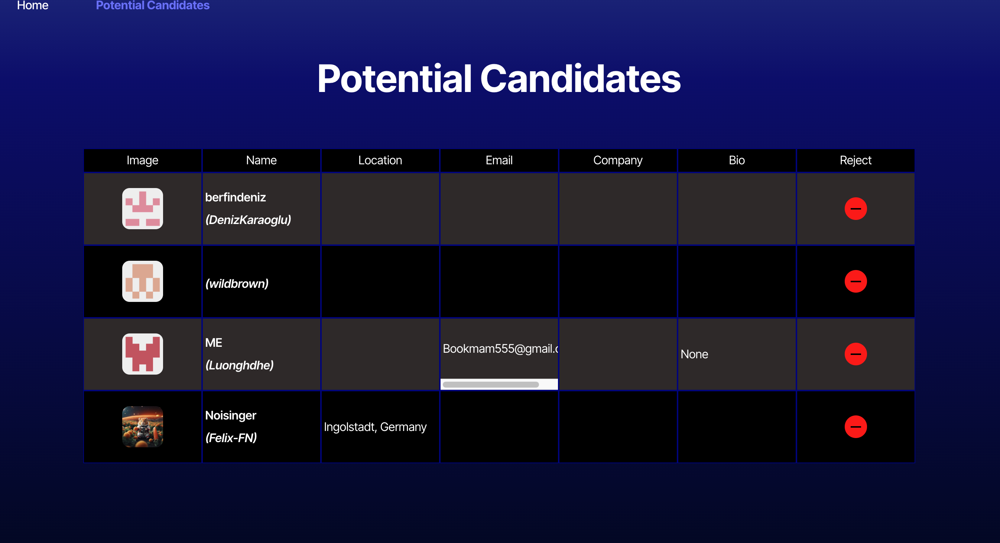

# Candidate Search

## Deployed website
https://module-13-challenge-candidate-search-zu21.onrender.com/

## Setup instructions
If you want to work on this repository on your machine you can:
1. Clone this repository
2. Create `.env` file in the root directory and add VITE_GITHUB_TOKEN=YOUR_GITHUB_TOKEN
3. Run `npm install`
4. Run `npm run build`
5. Run `npm run dev`

## Application Overview
Potential employer can search GitHub users and them as "Potential Candidate".

On the **Home** page you will see a user's profile and two buttons(minus and plus).

If you click on the "+" button, you will add the user as "Potential Candidate". Otherwise, if you click on the "-" button, you will see the next candidate, without adding him as "Potential Candidate".

The maximum number of users you will see per session is 30. If you want to see more users, you have to refresh the page.

If you go to the **Potential Candidates** page, you will see a list of candidates that you have selected. You can remove a user from that list by clicking on the "-" button.

Home Page - Search Candidates

Potential Candidates
